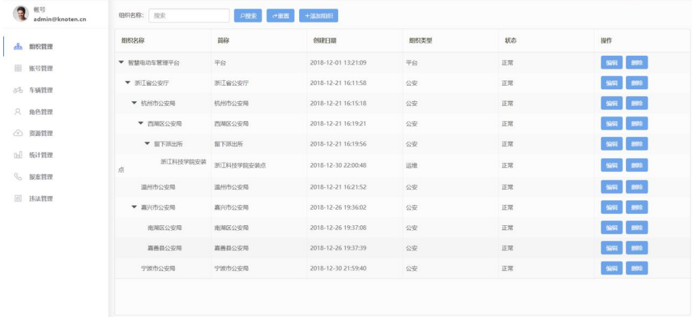
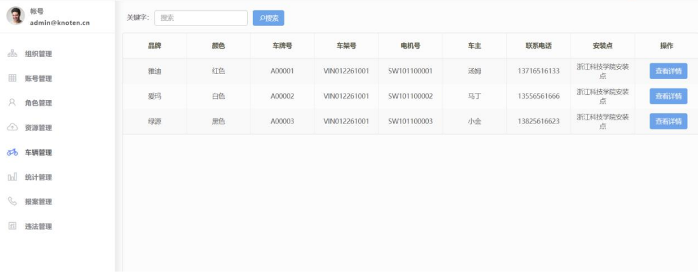
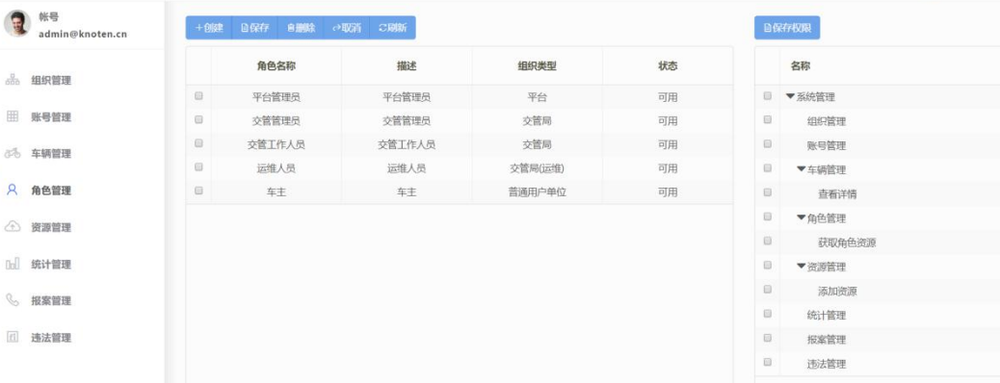
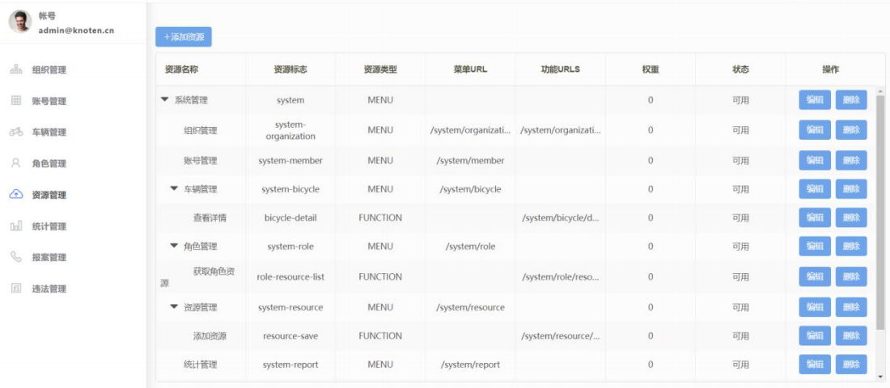

### 智慧电动车管理平台（后台权限管理平台）

***

## 项目简介

电动车的监管一直是一个让公安部门头疼的问题，而我们的这个产品能够有效地为公安监管部 门解决电动车监管难的问题，为车主解决电动车易被盗的问题，并且能让车主实时获取电动车的最新动态，有效地保障了车主的生命财产安全。我们平台的主要功能有：模拟GPS 定位、轨迹回放、一键报案、电动车监管、交管部门组织管理等。

## 交管部门管理端界面

### 1. 登陆界面

### 2. 组织管理界面

### 3. 车辆管理界面

### 4. 角色管理界面

### 5. 资源管理界面

## License

This repository is released under the Apache 2.0 license as found in the [LICENSE](https://github.com/rnzhiw/Parallel_hyperparameter_optimization_for_loan_default_prediction/blob/main/LICENSE.md) file.